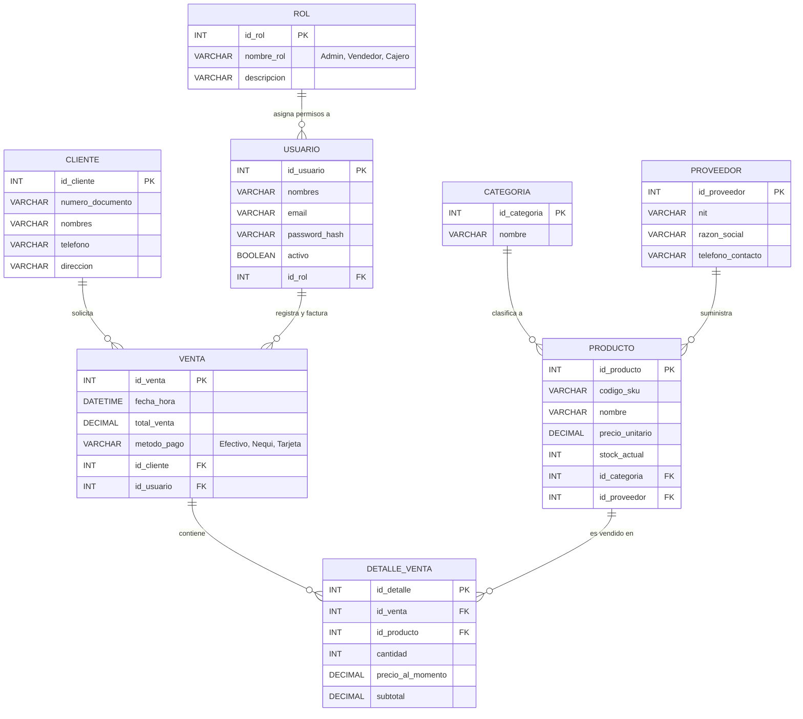
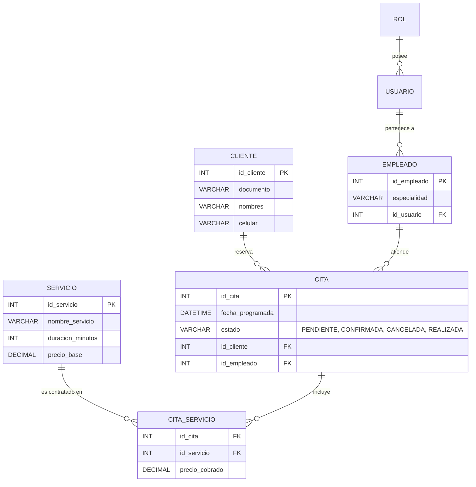

# GUÍA DIDÁCTICA 02: MODELO CONCEPTUAL (DER) APLICADO A PROYECTOS DE SOFTWARE
## Estructuración del Diagrama Entidad-Relación para la Propuesta Técnica
### Ficha 3535599 — Tecnólogo en Análisis y Desarrollo de Software (ADSO)

> **CENTRO:** CENTRO DE DESARROLLO INDUSTRIAL, EMPRESARIAL Y CAMPESINO - CDIEC (Código: 9232)  
> **REGIONAL:** Cundinamarca  
> **INSTRUCTOR FACILITADOR:** Melqui Alexander Romero Veru  
> **COMPETENCIA:** 220501094 — Estructurar propuesta técnica de servicio de tecnología de la información  
> **DOCUMENTO DESTINO:** `Modelo propuesta tecnica.doc` (Sección *Estrategia de Implementación*)  

---

## 1. El Propósito del Modelo Conceptual en la Propuesta Técnica

En la sección de **"Herramientas y metodologías -> ESTRATEGIA DE IMPLEMENTACIÓN"** de la propuesta técnica institucional, el cliente o evaluador busca una evidencia clara:  
> **¿El equipo de desarrollo realmente entiende cómo se comunican las partes del sistema?**

El **Modelo Entidad-Relación (MER / DER)** es el plano arquitectónico visual de su software. Al igual que un arquitecto no levanta paredes sin planos, un desarrollador de software no programa controladores ni APIs sin un diagrama DER validado.

---

## 2. Tipos de Entidades en el Desarrollo de Software

```
┌────────────────────────────────────────────────────────┐
│                   TIPOS DE ENTIDADES                   │
├────────────────────────────┬───────────────────────────┤
│ ENTIDADES FUERTES          │ ENTIDADES DÉBILES         │
│ Existen por sí mismas en   │ Dependen de otra entidad  │
│ el negocio.                │ para tener sentido.       │
│ Ej: `usuarios`, `clientes`,│ Ej: `detalle_venta`       │
│     `productos`, `roles`.  │     (no existe sin venta).│
└────────────────────────────┴───────────────────────────┘
```

---

## 3. Arquitectura DER Estándar 1: Software de Comercio e Inventario (POS / ERP)

Este modelo sirve como plantilla base para los equipos cuyo proyecto formativo sea un **Punto de Venta, E-commerce, Ferretería, Droguería o Tienda de Ropa**:



### ¿Por qué este modelo es impecable técnicamente?
1. **Seguridad:** Los roles están desacoplados de los usuarios; si se crea el rol *"Auditor"*, no hay que alterar la tabla `usuarios`.
2. **Histórico de precios:** En `detalle_venta` se almacena `precio_al_momento`. Si el producto sube de precio el próximo mes, ¡las facturas del mes pasado no se alteran!
3. **Auditoría de personal:** Cada venta registra qué empleado (`id_usuario`) la realizó, evitando fraudes internos.

---

## 4. Arquitectura DER Estándar 2: Software de Agendamiento de Citas y Servicios

Este modelo sirve como plantilla base para los equipos cuyo proyecto sea un **Consultorio Odontológico, Peluquería/Spa, Taller de Mecánica o Gimnasio**:



---

## 5. Cómo Incluir el DER en su Propuesta Técnica (`.doc`)

Para que la sección de la propuesta técnica cumpla con los estándares de evaluación institucional del CDIEC:

1. **Diseñar el diagrama con sintaxis Mermaid o en una herramienta gráfica:**
   - Puede usar [Mermaid Live Editor](https://mermaid.live) o herramientas como draw.io / StarUML.
2. **Exportar a imagen de alta resolución (PNG o SVG).**
3. **Insertar en el documento Word `Modelo propuesta tecnica.doc`** debajo del título:  
   *`Estrategia de Implementación del Proyecto -> Modelo Entidad-Relación Propuesto`*.
4. **Acompañar siempre de una breve descripción narrativa:**  
   Explique en 2 párrafos cómo viaja el flujo de datos desde que el cliente interactúa con el sistema hasta que se registra en la base de datos.
